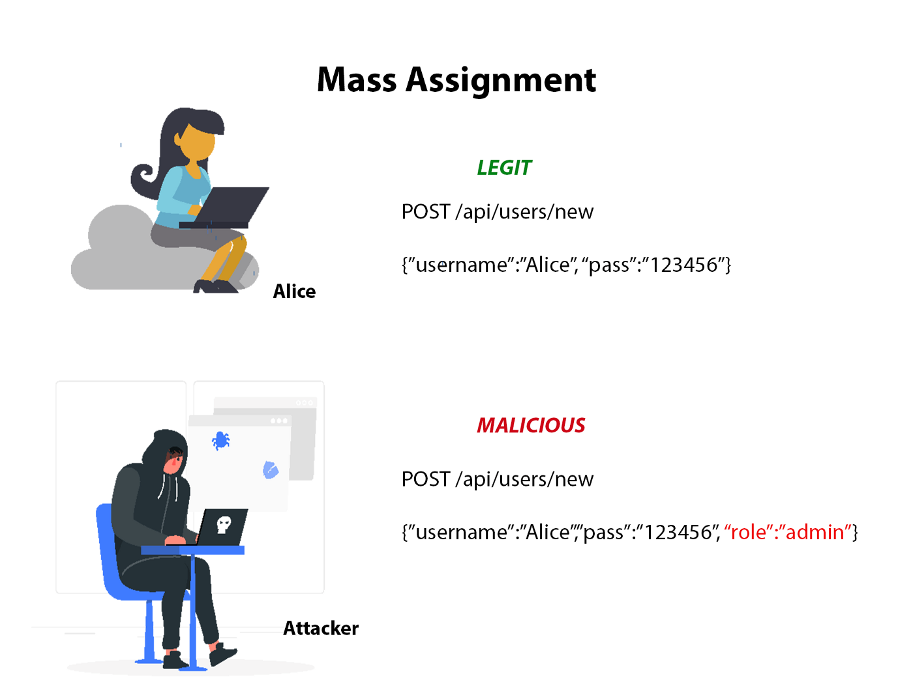

# Mass-Asignment Attack / Parameter Binding

## ¿Qué es un Ataque de Asignamiento Masivo?

Un ataque de asignamiento masivo, es un ataque se realiza usando parámetros adicionales en la solicitud al servidor, para que este la interprete.

<figure><figcaption></figcaption></figure>

## Escenario 1

Nos encontramos en un formulario de registro, del cual interceptamos la petición de registro:

<figure><figcaption></figcaption></figure>

El servidor nos contesta con otro formato JSON:

<figure><figcaption></figcaption></figure>

Como vemos, en la respuesta del servidor, nos devuelve parámetros que nosotros no hemos enviado. Pues en este punto, podemos intentar hacer un Ataque de Asignamiento Masivo o Parameter Binding, en este caso, de lado de nuestra petición de registro vamos a añadir el parámetro de `role` y asignarle otro valor:

<figure><figcaption></figcaption></figure>

La respuesta a esta petición modificada es exitosa, y nuestro usuario se ha registrado con rol de administrador


En algunos casos, el servidor no responde con ningún parámetro nuevo, por lo que podemos usar una ataque de fuerza bruta en las cabeceras de la solicitud para determinar que nombre de párametro y que valor, nos permitirá hacer cambios.

