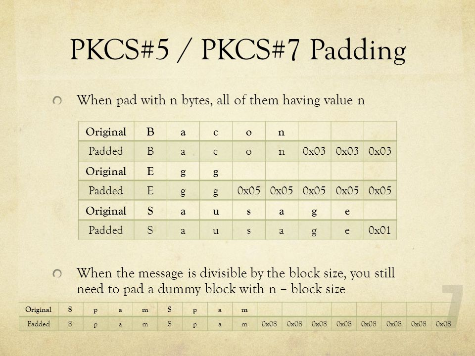
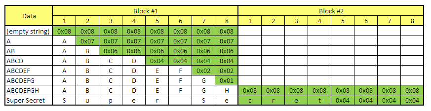
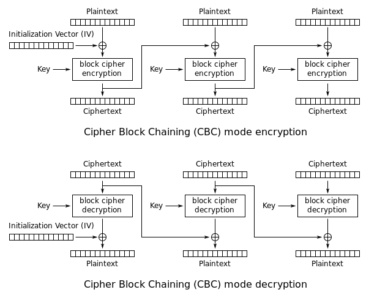

# Padding Oracle Attack (POO)

## ¿Que es un Padding Oracle Attack?

El Padding Oracle Attack es un ataque criptográfico que se realiza con la finalidad de usar una cookie de un usuario administrador o con privilegios en un aplicativo web mediante la modificación de la cookie

## ¿Como funciona?

El POO se aprovecha de una vulnerabilidad en el modo de operación CBC (Cipher Block Chaining) para descifrar la cookie sin tener la clave.

El modo CBC es un modo de operación de cifrado por bloques, este se utiliza para cifrar mensajes de longitud variable. Este funciona de manera que cifra cada bloque de texto plano uno detrás de otro y posteriormente xoreando el bloque cifrado con el bloque anterior. El resultado de estas operaciones, se utiliza para cifrar el siguiente bloque.

<figure><figcaption></figcaption></figure>

El modo de cifrado CBC utiliza un relleno llamado PKCS#7 para que todos los bloques tengan el mismo tamaño, este consiste en un numero de bytes que se añaden al final de texto plano. Dichos bytes, contienen el numero de bytes de relleno que se agregaran al texto plano:

<figure><figcaption></figcaption></figure>

<figure><figcaption></figcaption></figure>

El POO aprovecha el hecho de que el modo CBC revele si el relleno es valido o no, si es valido se puede descifrar, si en cambio no es valido no se podrá descifrar y devolverá un error. Por ejemplo:&#x20;

El atacante tiene un bloque de texto cifrado conocido. El atacante intenta cambiar el primer bit del texto cifrado. El atacante envía el texto cifrado modificado al sistema que descifra el mensaje. El sistema devuelve un error. El atacante sabe que el bit cambiado no era parte del relleno. El atacante repite los pasos anteriores hasta que haya descifrado todos los bits del texto cifrado.

<figure><figcaption></figcaption></figure>


1. Enlaces de Interés:
2. [https://book.hacktricks.xyz/crypto-and-stego/padding-oracle-priv](https://book.hacktricks.xyz/crypto-and-stego/padding-oracle-priv)
3. [https://keepcoding.io/blog/que-es-un-padding-oracle-attack/](https://keepcoding.io/blog/que-es-un-padding-oracle-attack/)
4. [https://slideplayer.com/slide/4625352/](https://slideplayer.com/slide/4625352/)
5. [https://sysfatal.github.io/oracle.html](https://sysfatal.github.io/oracle.html)
6. [https://www.youtube.com/watch?v=lkPBTJ3yiCI\&ab\_channel=SecureCodeWarrior](https://www.youtube.com/watch?v=lkPBTJ3yiCI\&ab\_channel=SecureCodeWarrior)

