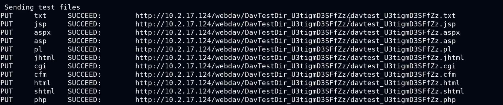

# 🧪 PortSwigger Lab 6

> Este laboratorio contiene una vulnerabilidad de inyección SQL en el filtro de categoría de producto. Los resultados de la consulta se devuelven en la respuesta de la aplicación para que pueda usar un ataque UNION para recuperar datos de otras tablas.
>
> La base de datos contiene una tabla diferente llamada `users`, con columnas llamadas `username` y `password`.
>
> Para resolver el laboratorio, realice un ataque UNION de inyección SQL que recupere todos los nombres de usuario y contraseñas, y use la información para iniciar sesión como `administrator` usuario.

Comprobamos que es vulnerable:

<figure><figcaption></figcaption></figure>


## ¿Porque `/filter?category=Pets' UNION SELECT username,password FROM users--` no funciona?

\
\
Este payload no funciona porque esta tabla, solo admite un campo de tipo String.

¿Que debemos hacer en esta situación?

Podemos mostrar en la primera columna un valor NULL y en la segunda (que es la que admite el String) mostramos los valores de usuario y contraseña.\
Estos valores, como son 2 campos en la misma columna, debemos de concatenarlos para que actúen como uno solo


Buscamos el campo que admite String:

<figure><figcaption></figcaption></figure>

Tras ver que es el 2º, en el primero inyectaremos un valor nulo y en el segundo la concatenación de los valores que nos pide el lab (username y password):

<figure><figcaption></figcaption></figure>

Una ves tenemos las credenciales, iniciamos sesión y resolvemos el lab:

<figure><figcaption></figcaption></figure>
