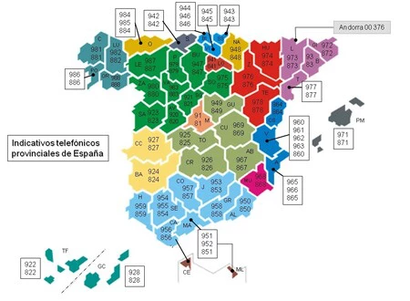

# ℹ️ Obtención de información de Sujetos

## ¿Por donde empiezo?

Cuando queremos buscar información acerca de personas, necesitamos partir de unos datos básicos como el nombre y apellidos u otros datos que nos permitan identificar a la persona en cuestión y que puedan estar expuestos en internet, por ejemplo de nada nos sirve saber sus características físicas (Alto, pelo castaño, ojos azules) en un primer momento, datos útiles como DNI, Nombre con apellidos completos, nickname, son datos que nos permiten hacer una búsqueda inicial sobre el sujeto.

Por ejemplo, si tenemos el nombre del sujeto, lo que recomiendo es buscarlo de diferentes formas:

```
"Nombre Apellido1 Apellido2"
```

En este caso usamos el [operador " ](google-hacking.md#operadores-y-usos)para poder buscar el nombre completo y enfocar la búsqueda. Hay que tener en cuenta que Google indexa el contenido de archivos, y en algunos casos en documentos oficiales los nombres no vienen escritos con esa disposición, si no que utilizan otra como:

```
"Apellido1 Apellido2, Nombre"

"Apellido2 Apellido1 Nombre"
```

## Búsqueda de Redes Sociales

Lo siguiente a partir de los resultados que nos arrojen esta búsqueda, es identificar posibles Nicknames que utilice,  y hacer una búsqueda con estos, ya que podríamos encontrar información adicional con eso.

Lo siguiente es buscar sus Redes Sociales (y plataformas donde este registrado/a), estas son la mayor fuente de información. Estas las podemos encontrar de dos formas:

1. Puede que la hayamos encontrado en la primera búsqueda que hicimos con el nombre, y a pesar de que hayamos encontrado algunas redes, otras pueden estar bajo su nickname
2. Esta es la forma más habitual, y es que, tras sabes su nickname hay ciertas herramientas que nos automatizan la búsqueda de RRSS

En el caso de que se de la 2º forma, existen muchas plataformas para buscar RRSS, una de ellas y la que más destaca por lo completa que es y gratuita es [https://www.idcrawl.com/](https://www.idcrawl.com/)  , esta web nos permite buscar tanto por el nombre como por el nickname. Después de saber cuales son sus RRSS, es hora de recolectar la máxima información posible, como he dicho las RRSS son una de las principales fuentes de información. (Otra web similar: [https://namechk.com/](https://namechk.com/))

Además de encontrar el perfil del sujeto que buscamos, podemos encontrar a la gente de su entorno, esto es muy sencillo, solo hay que ir a las redes que tenga publicas en las que haya comentarios y/o un sistema de me gustas, estos delatan fácilmente a las personas que son gente cercana suya, ya que vemos comentarios que se hacen destacar o usuarios que dejan un me gusta y/o comentario en todas las publicaciones recurrentemente. Adicionalmente podemos comprobar en su lista de seguidores y personas a las que sigue o a mencionado, si hay personas con su mismo apellido, y ahí tendremos a su familia, el circulo más cercano al sujeto, cabe mencionar que muchas familias suben fotos de sus hijos cuando son pequeños, por lo que en esas ocasiones tendremos también algo posterior a sus RRSS

## Búsqueda con reconocimiento Facial

A raíz de las RRSS, lo más seguro es que encontremos algunas fotos y esto nos viene perfecto para poder descubrir algo más, existen paginas que buscan fotos con reconocimiento facial, es cierto que muchos de los resultados que nos encontremos no van a coincidir con el sujeto que estamos investigando, pero estas webs, muchas veces descubren sitios en los que se menciona/aparece al sujeto. Existen dos principalmente, la primera es: [https://facecheck.id/](https://facecheck.id/) , y esta segunda que es algo más fiable que la primera es: [https://pimeyes.com/es](https://pimeyes.com/es) .


Si las imágenes que extraigamos para reconocimiento facial no tienen buena calidad, el reconocimiento no será efectivo, por lo que podemos utilizar un escalador de imágenes basado en Inteligencia Artificial que nos dará una imagen con mayor calidad: [https://www.upscale.media/es](https://www.upscale.media/es)


## Metadatos

Hay casos en los que nos encontramos documentos o imágenes que no están alojadas en RRSS, las webs de redes sociales eliminan los metadatos de las imágenes cuando son subidas a la plataforma, sin embargo muchos suben estas fotos a un blog personal o sitios donde no se realiza este proceso, por lo que podremos buscar en los metadatos información importante. Existe una herramienta llamada [FOCA](https://github.com/ElevenPaths/FOCA) desarrollada por [ElevenPaths](https://twitter.com/elevenpaths?lang=es), esta herramienta, nos permite extraer documentos, fotos, archivos... que estén indexados de una web, y esta analiza los archivos buscando información sensible y clasificándola.&#x20;

## Información Personal

En el proceso de búsqueda de información personal, podemos encontrar documentos y/o redes donde aparezca información como correos electrónicos, números de teléfono, número de DNI... En estos casos también se pueden hacer cosas con estos datos, dependiendo de los datos que obtengamos podemos procesarlos de una manera u otra:

### Email

En el caso de que nos topemos con un correo electrónico, deberemos de comprobar si existe, existen muchas webs, yo te recomiendo esta: [https://verifalia.com/validate-email](https://verifalia.com/validate-email)


En esta web se nos hace una sencilla búsqueda combinando el correo electrónico y las RRSS: [https://lullar-com-3.appspot.com/en](https://lullar-com-3.appspot.com/en)


En el caso de que no lo encontremos en internet, podemos hacer una pequeña "Fuerza bruta" para encontrarlo,&#x20;

A la hora de crear una dirección de email, la gente suele poner:

* Su nombre completo.
* Sus iniciales (o una combinación, como inicial + apellidos completos).
* Un apodo o _nickname._

Para ello hay una forma de saber cual es su correo, este método funciona especialmente bien si el usuario tiene foto de perfil en su correo, se trata de una [Hoja de Documentos de Google en Excel](https://docs.google.com/spreadsheets/d/1\_EeTgmForj7enHc21eRUhXZUNj\_4ycGc8xtPFE5-v9E/edit#gid=0) donde hay un permutador de correos electrónicos y si pasas el cursor por encima o haces clic en el correo, podrás ver la foto, y ese será el correo correcto


Una forma de verificar muchos correos electrónicos es mediante la plataforma:[https://hunter.io/search](https://hunter.io/search)


### Teléfono

Una de las redes sociales que no fallan en este aspecto es WhatsApp, todo el mundo la tiene, y solo deberemos de añadir el contacto, si podemos escribirle es que tiene WhatsApp.

Una manera de saber de que operador es, es mediante [esta web](https://numeracionyoperadores.cnmc.es/portabilidad/movil), si es cierto que puede fallar si el usuario a cambiado muchas veces de compañía y a hecho la portabilidad con el número

En el caso de que el teléfono sea fijo, tenemos este mapa y [web ](https://www.guiaespana.net/prefijos-telefonicos/)donde nos indican los prefijos y su provincia correspondiente:&#x20;

<figure><figcaption><p>Imagen extraída de: xatakamovil.com</p></figcaption></figure>

### Matriculas de vehículos

Si resulta que el sujeto ha publicado una foto con la matricula de su vehículo en las redes, en España solo podremos ver la fecha de matriculación en algunas [webs ](https://www.seisenlinea.com/calcular-fecha-matriculacion/)y pocos datos más a no ser que [solicites un informe](https://sede.dgt.gob.es/es/vehiculos/informe-de-vehiculo/) a la Dirección General de Trafico (DGT) o comprarlo en [Carfax](https://www.carfax.eu/), en cambio en países como el Reino Unido, con la matricula podremos ver algo más de información en la propia [web del gobierno](https://vehicleenquiry.service.gov.uk/)
